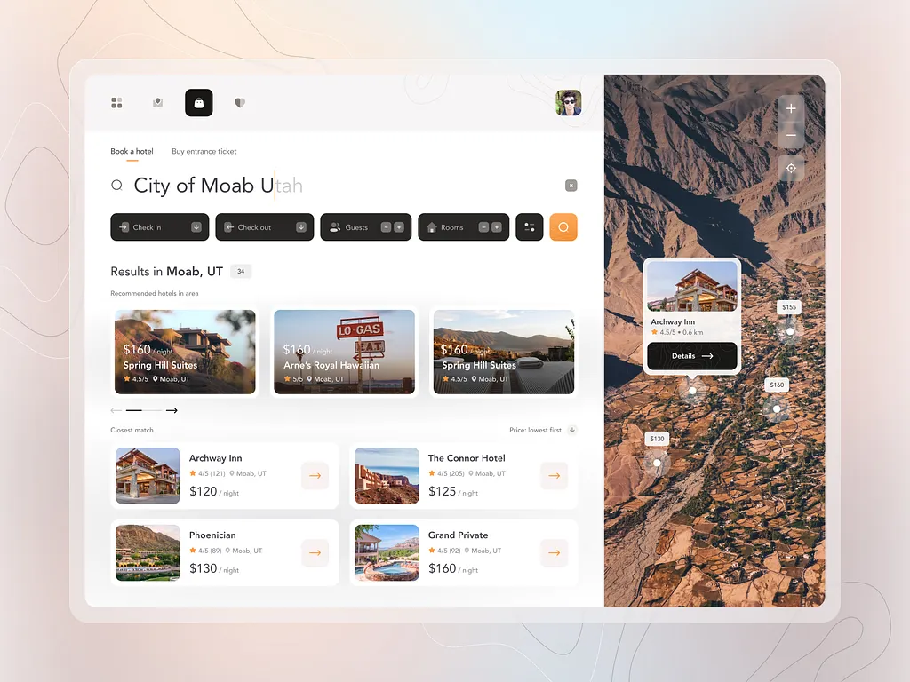

# Wallpaper Thing

An intelligent desktop wallpaper manager that automatically changes your wallpaper based on time of day and weather conditions.

## Features

- **🌅 Time-Based Wallpapers**: Automatically switch wallpapers for dawn, morning, midday, afternoon, dusk, evening, night, and late night
- **🌦️ Weather-Aware**: Dynamic wallpaper changes based on current weather conditions (rain, thunderstorm, snow, cloudy, sunny, fog)
- **📚 Collections System**: Organize multiple wallpaper sets for different moods or themes
- **⚡ Smart Priority**: Weather conditions override time periods for more contextual wallpapers
- **🖥️ System Tray Integration**: Convenient access from your system tray
- **🔄 Background Scheduler**: Automatic monitoring and wallpaper switching
- **💾 Backup & Export**: Save and share your wallpaper collections
- **🎨 Modern Interface**: Clean, intuitive React-based UI

## Installation

### Download Release

1. Download the latest release from the [Releases page](../../releases)
2. Run the installer for your platform
3. Launch Wallpaper Thing from your applications menu or system tray

## Quick Start

### 1. Get a Weather API Key

Wallpaper Thing uses WeatherAPI.com for weather data. Follow our guide to get your free API key:

📖 **[How to Get a WeatherAPI.com Key](WEATHER_API_SETUP.md)**

### 2. Initial Setup

1. Launch Wallpaper Thing (look for the icon in your system tray)
2. Click the tray icon to open the interface
3. Go to Settings and enter your WeatherAPI.com API key
4. Configure your location or enable auto-location

### 3. Create Your First Collection

1. Navigate to the Collections page
2. Create a new collection (e.g., "Nature", "Minimalist", "Dark Mode")
3. Add wallpapers for different categories:
   - **Weather conditions**: thunderstorm, rain, snow, fog, cloudy, sunny
   - **Time periods**: dawn, morning, midday, afternoon, dusk, evening, night, late_night
   - **Fallback**: default (used when no other conditions match)

### 4. Start the Scheduler

1. Go to the Home page
2. Enable the wallpaper scheduler
3. Set your preferred update interval (recommended: 15-30 minutes)

## How It Works

Wallpaper Thing uses a customizable priority-based system to select the perfect wallpaper:

1. **Weather conditions** have the highest default priority (thunderstorm: 100, rain: 90, etc.)
2. **Time periods** have medium default priority (dawn: 75, dusk: 70, etc.)
3. **General weather** has lower default priority (cloudy: 45, sunny: 40)
4. **Default** is the fallback (priority: 0)

You can customize these priorities in each collection to match your preferences - want sunny weather to override time periods? Just increase its priority!

When multiple conditions match, the highest priority wallpaper is selected.

## Backup & Sync

Export your collections to share with others or backup your configurations:

1. Go to Settings
2. Click "Export Backup"
3. Save your collections file
4. Import on other devices or after reinstalling

## License

This project is licensed under the MIT License - see the [LICENSE](LICENSE) file for details.

The MIT License is a permissive license that allows you to use, modify, and distribute this software freely, even for commercial purposes, as long as you include the original copyright notice.

## Support

If you encounter issues or have suggestions:

- Check the [Issues page](../../issues) for known problems
- Create a new issue with detailed information about your problem
- Include your OS, app version, and any error messages

---

_Made with ❤️ for people who appreciate the perfect wallpaper for every moment_
